# GnB AI Project Assignments
경북대학교 전자공학부 동아리 GnB의 AI 프로젝트 교육의 과제물 공지 및 제출 repo입니다.

## 교육 진행 계획

| 날짜 | 주제 |
|------|------|
| 0주차 (3.26) | 프로젝트 소개 및 파이썬 복기 |
| 1주차 (4.2) | 인공지능의 정의와 선형 회귀 |
| 2주차 (4.9) | 과적합 문제와 정규화 |
| 3주차 (4.16) | 다층 퍼셉트론 모델 |
| 4주차 (5.21) | 순환 신경망 모델 |
| 5주차 (5.28) | 비지도 학습 |
| 6주차 (6.4) | 강화 학습 |
| 7주차 (6.11) | 판별 모델과 생성 모델 |

각 주차별로 기계학습 이론 공부와 파이썬 코딩 실습을 실시합니다. 
매주 코딩 과제가 주어지며, 이론을 복습할 수 있는 계산 예제도 제공합니다.
이 과정 후 여름 방학 및 2020년 2학기에 유명한 딥러닝 모델들을 텐서플로우/파이토치 등으로 직접 구현해보고, 
이들의 정확도를 높일 수 있는 여러가지 학습 기법들을 적용해보는 프로젝트가 개설됩니다. 
더 나아가 Kaggle과 dacon.io의 대회나 공모전에 참가하는 등의 실습을 진행할 예정입니다.

## 과제 제출 방법

  
펼치기

  
### 1. 원본 repository fork해오기
[yh08037/gnbbai20201](https://github.com/yh08037/gnbai20201) repository를 본인의 github계정으로 fork합니다. (처음 한번만 하면 됩니다.)
  
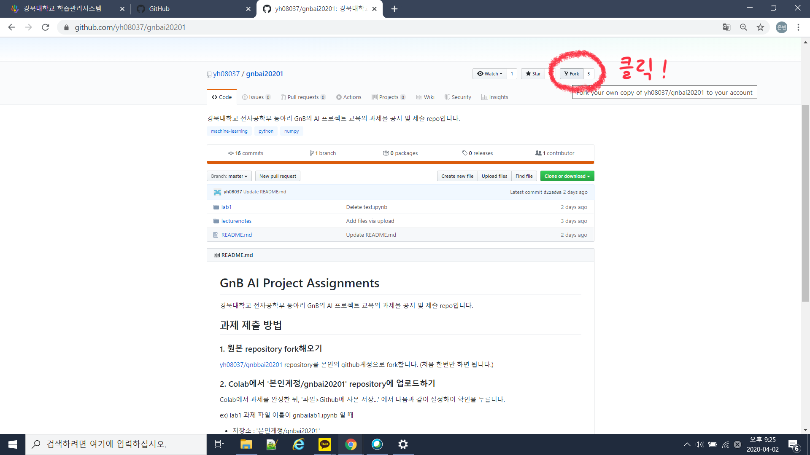
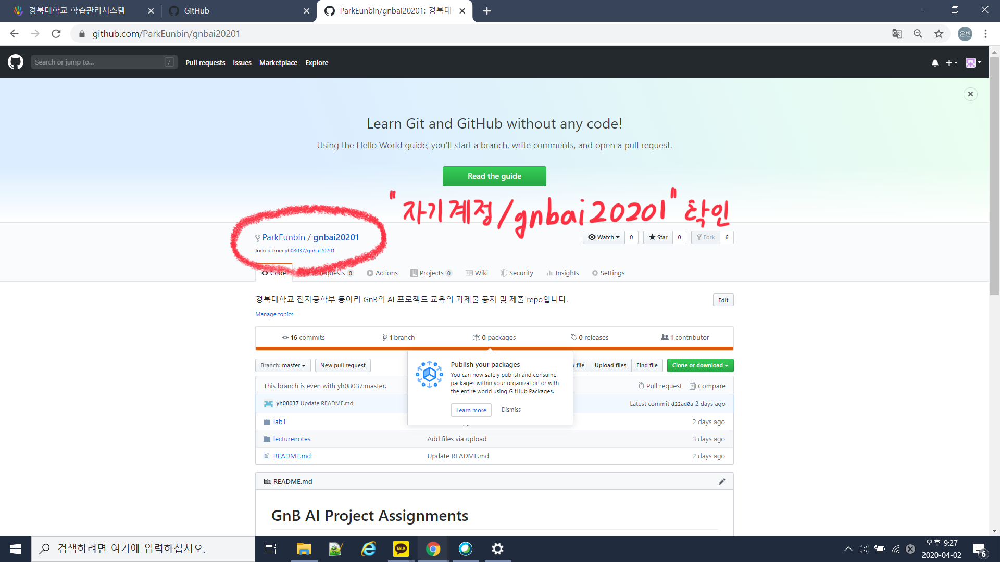

### 2. Colab에서 '본인계정/gnbai20201' repository에 업로드하기
Colab에서 과제를 완성한 뒤, '파일>Github에 사본 저장...' 에서 다음과 같이 설정하여 확인을 누릅니다.

ex) lab1 과제 파일 이름이 gnbailab1.ipynb 일 때
* 저장소 : '본인계정/gnbai20201'
* 파일 경로 : lab1/자기이름(영어로)/gnbailab1.ipynb
* 변경사항 설명 메시지 : ex) 김도훈 lab1 제출

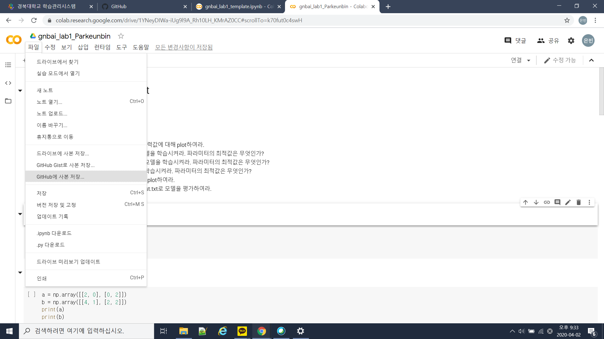
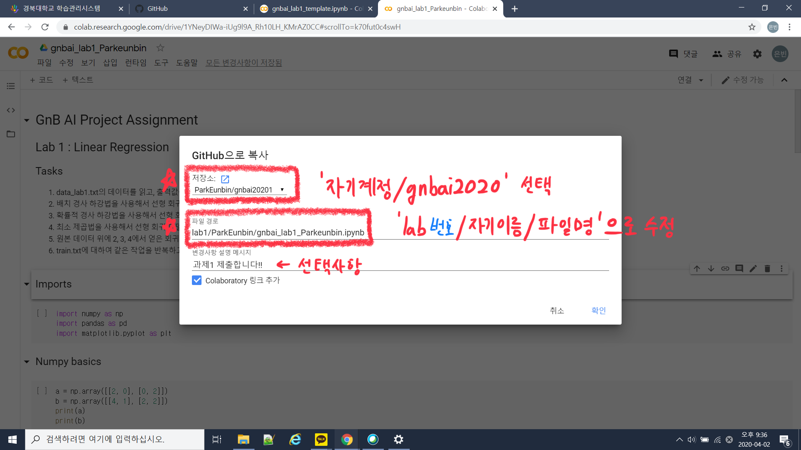
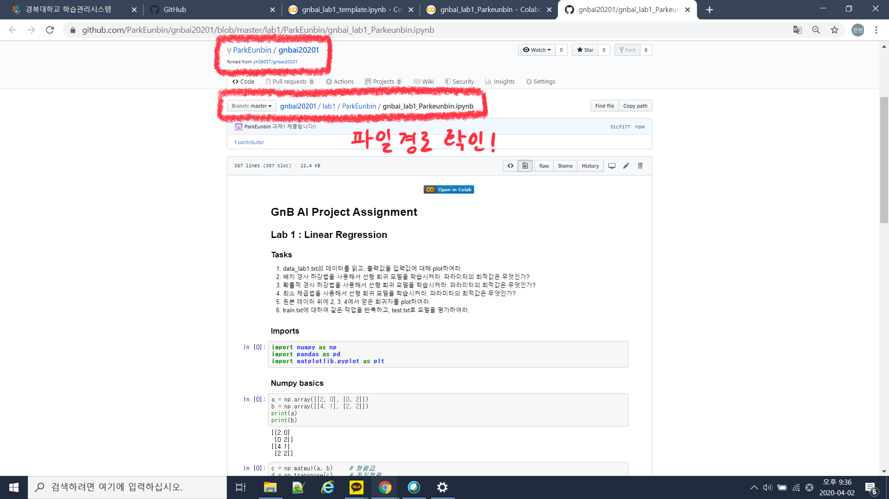

### 3. Pull request 생성하기
fork해온 '본인계정/gnbai20201' repository에서 "New Pull Request"를 클릭하여 Pull request를 생성합니다.
  
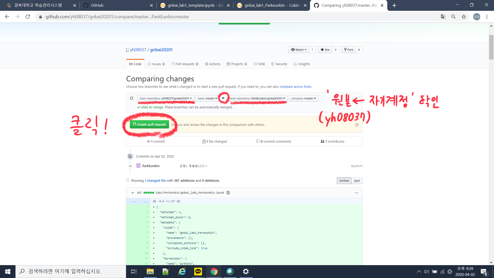
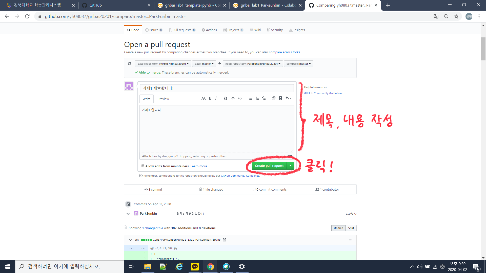
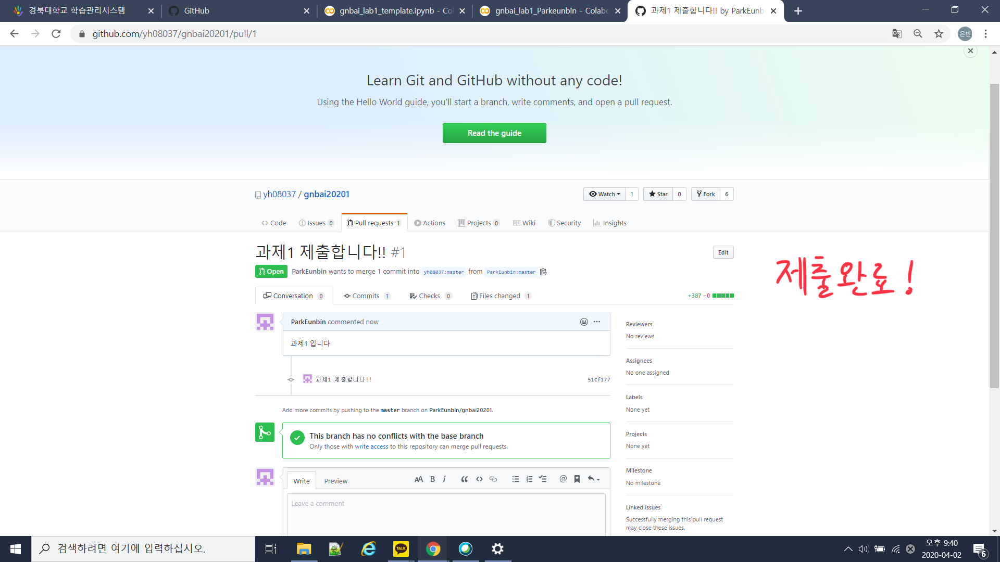

## 내 repository를 원본 repository와 동기화하기

  
펼치기

  
### 1. '본인계정/gnbai20201' repository에서 'Compare'클릭
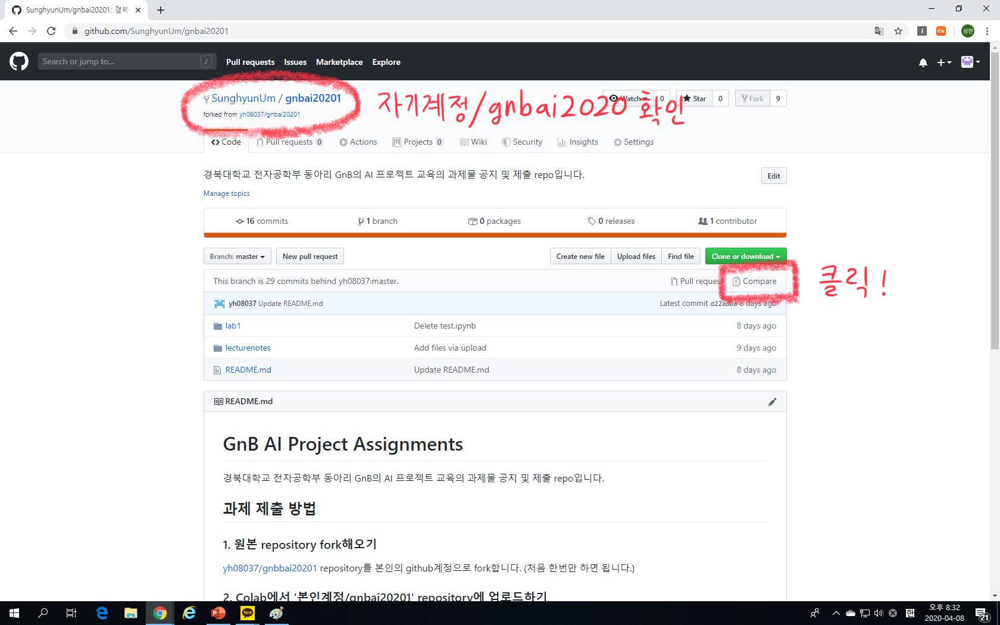

### 2. 'switching the base' 클릭
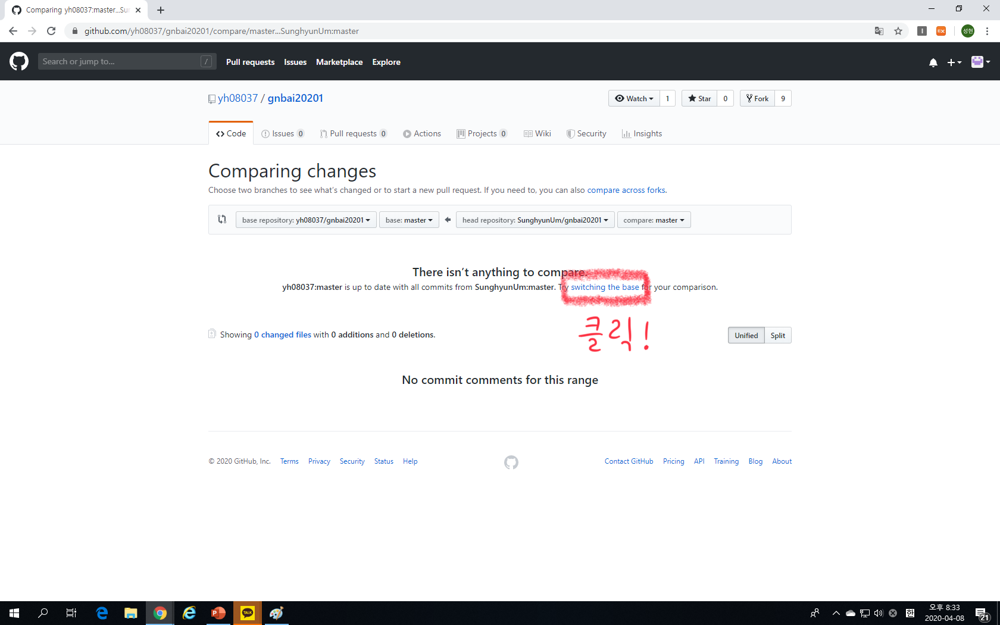

### 3. Create pull request 클릭
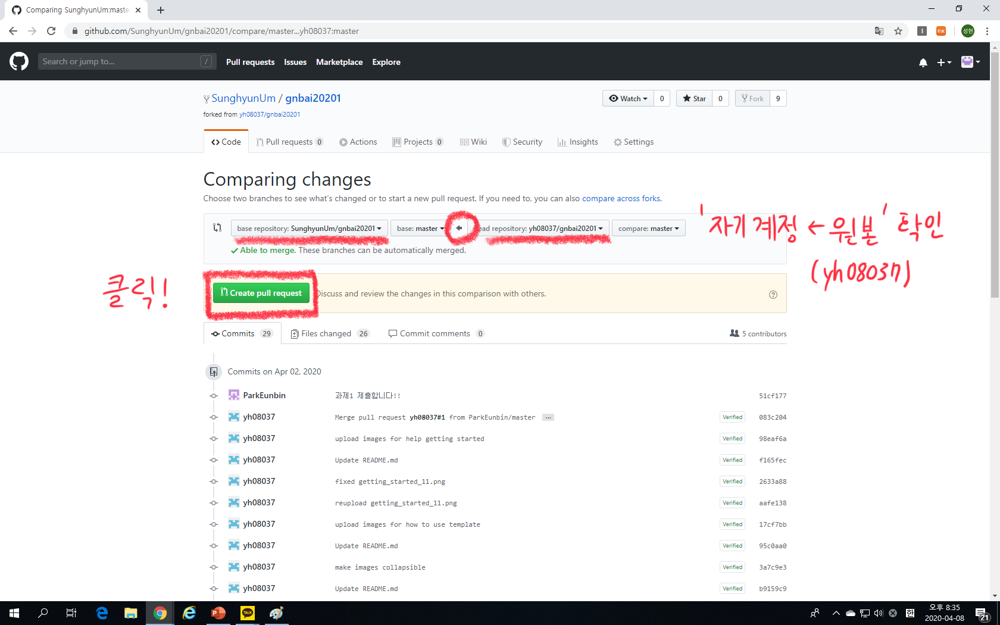

### 4. pull request의 제목과 내용을 작성하고 Create pull request 클릭
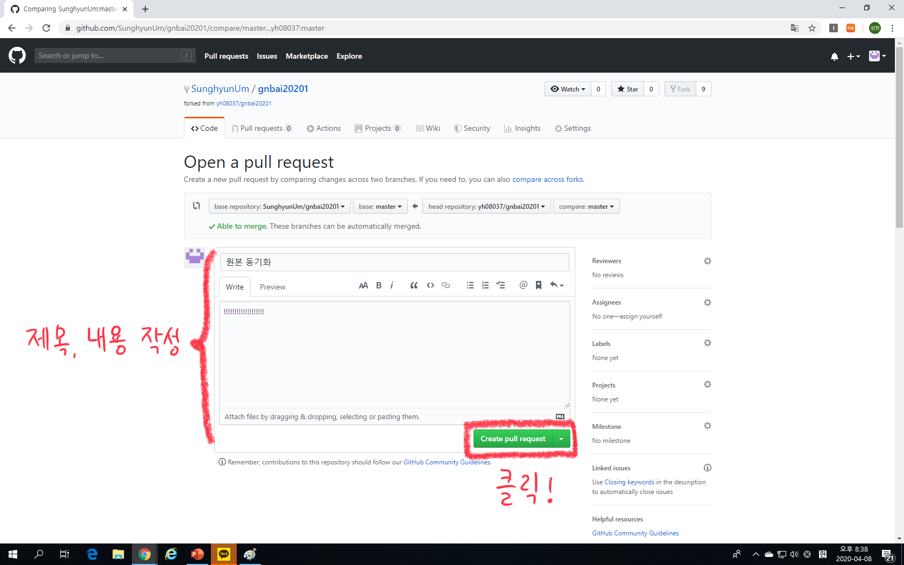

### 5. 'Merge pull request'를 'Rebase and merge'로 변경하고 클릭
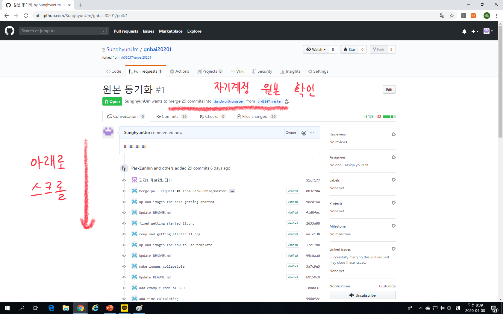
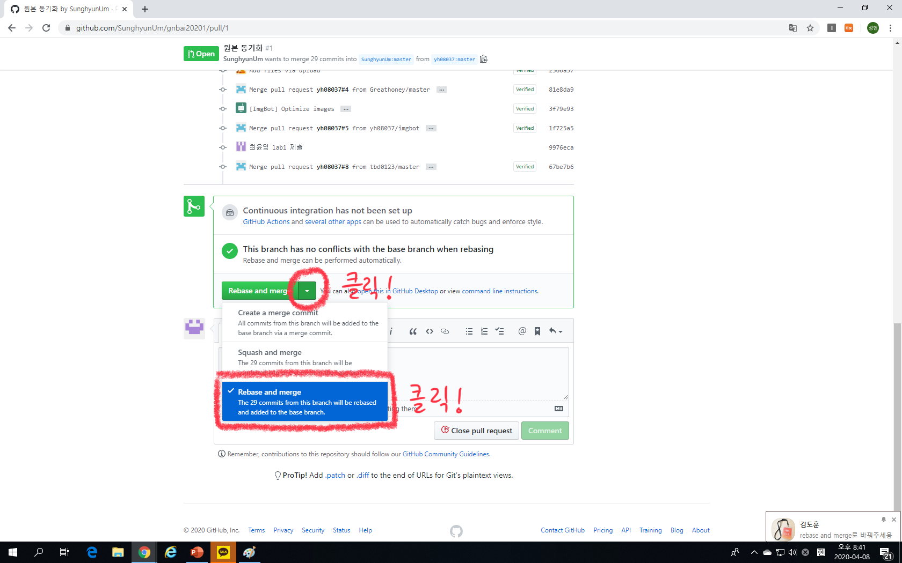
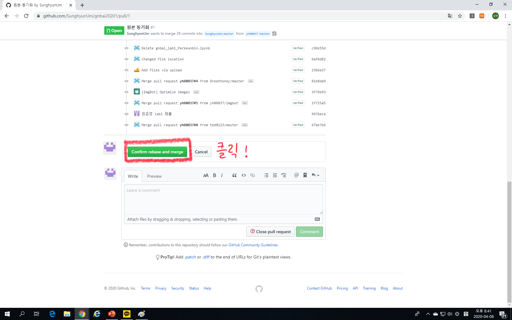
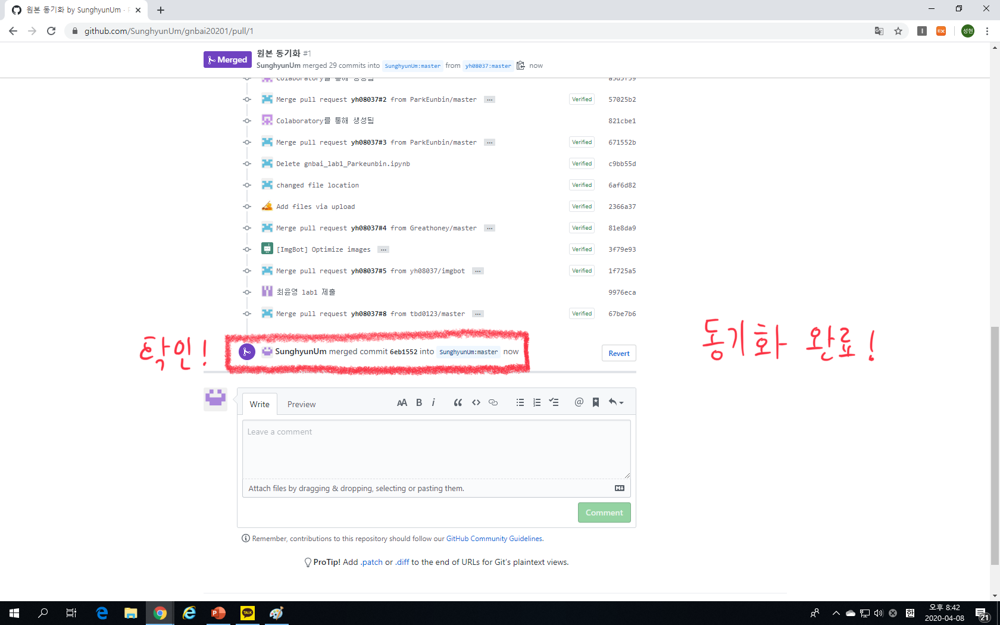

