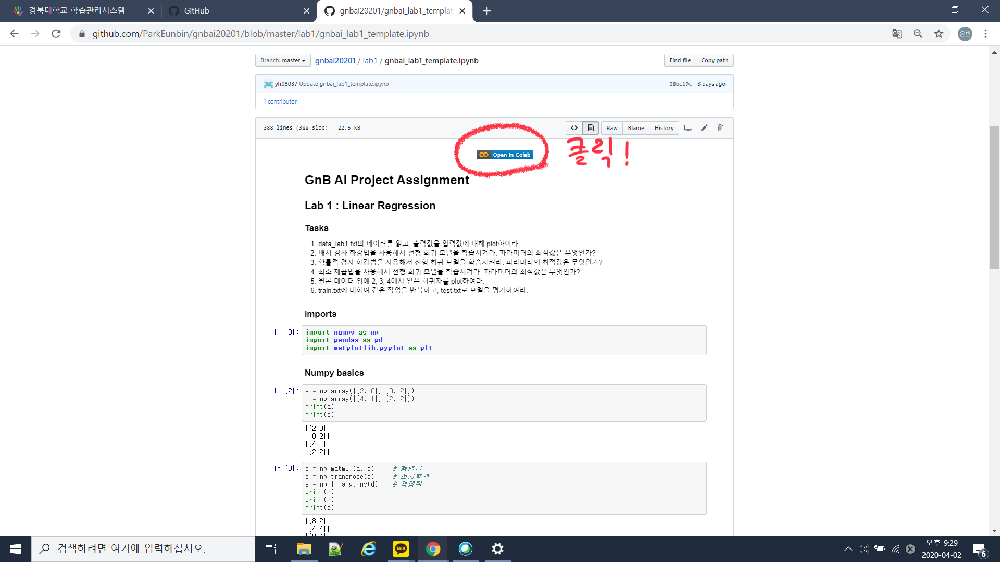
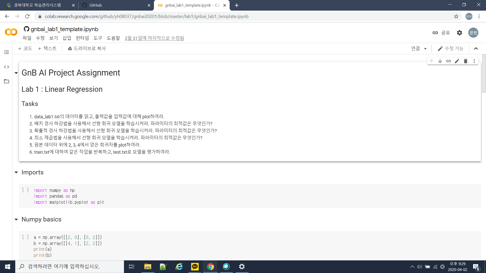
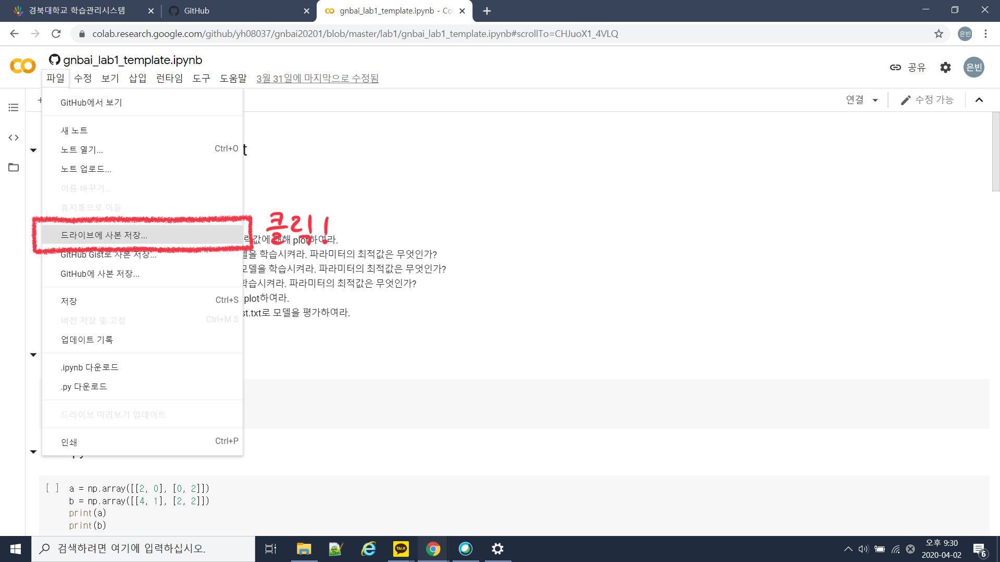
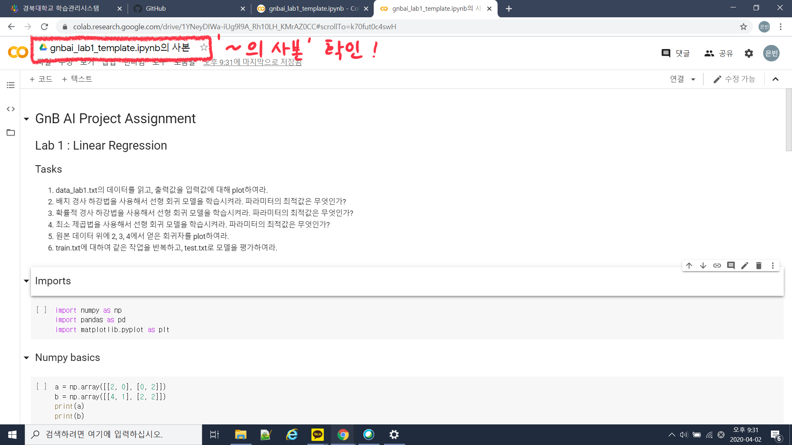
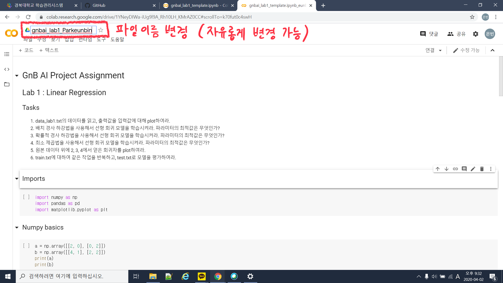

# Lab 1 : Linear Regression
## Data
|파일명|파일 형식|
|-------------|---------------------------|
|data_lab1.txt|space로 구분된 100행 2열 데이터|
|train.txt|tab으로 구분된 140행 2열 데이터|
|test.txt|tab으로 구분된 60행 2열 데이터|
## Tasks
1. data_lab1.txt의 데이터를 읽고, 출력값을 입력값에 대해 plot하여라.
2. 배치 경사 하강법을 사용해서 선형 회귀 모델을 학습시켜라. 파라미터의 최적값은 무엇인가?
3. 확률적 경사 하강법을 사용해서 선형 회귀 모델을 학습시켜라. 파라미터의 최적값은 무엇인가?
4. 최소 제곱법을 사용해서 선형 회귀 모델을 학습시켜라. 파라미터의 최적값은 무엇인가?
5. 원본 데이터 위에 2, 3, 4에서 얻은 회귀자를 plot하여라.
6. train.txt에 대하여 같은 작업을 반복하고, test.txt로 모델을 평가하여라.
## 코드 템플릿 사용법
### 1. gnbai_lab1_template.ipynb를 열어 'Open in Colab'을 클릭합니다.

### 2. '파일>드라이브에 사본 저장...'을 클릭하여 사본 생성

### 3. 파일이름 바꾸고 코딩 시작

